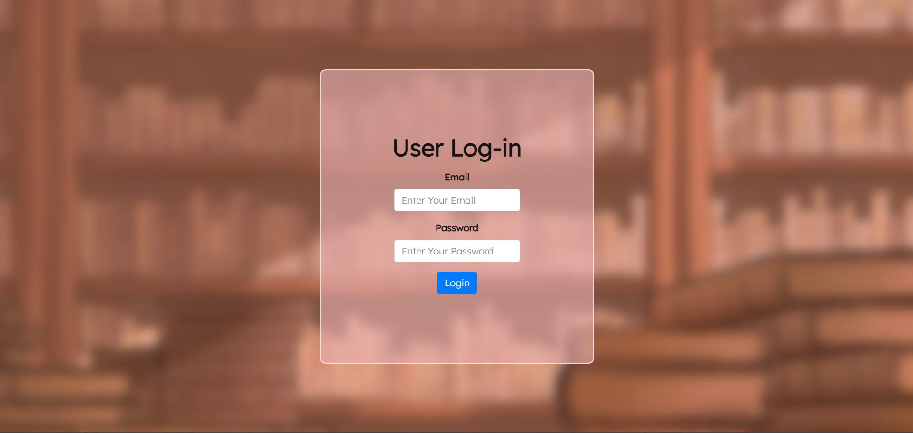
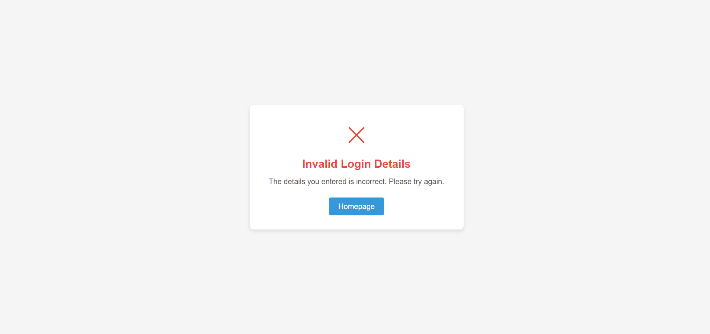
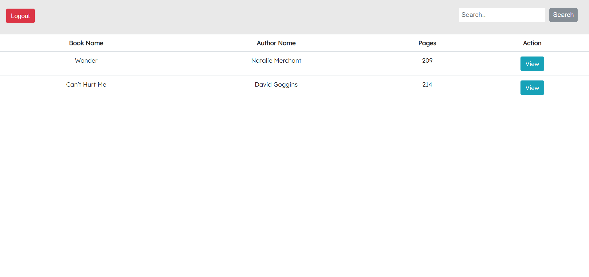
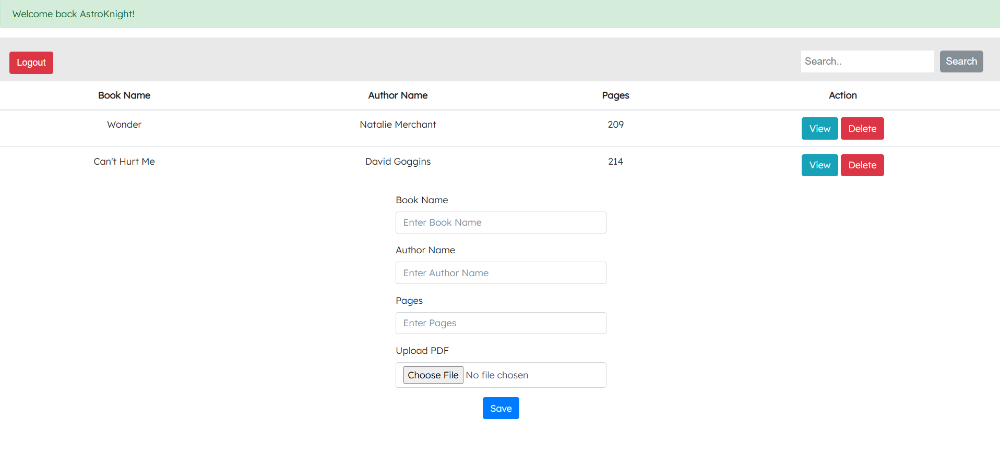

# Digital Library #
A Library Management System designed to manage readers and digital books in PDF format.

## Features
* User Sign-in/Login & Authentication
* Database Connectivity
* Customized Search
* CRUD operation on Books
* Integrated PDF Reader for seamless reading

## Technologies Used
#### Frontend:
* HTML
* CSS
* Javascriot
* Bootstrap
#### Backend: 
* PHP
* MySQL

## Images

